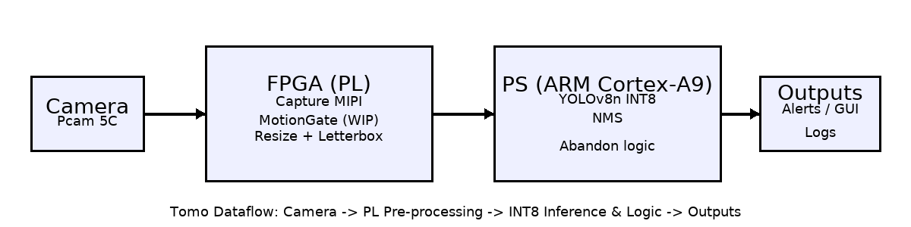
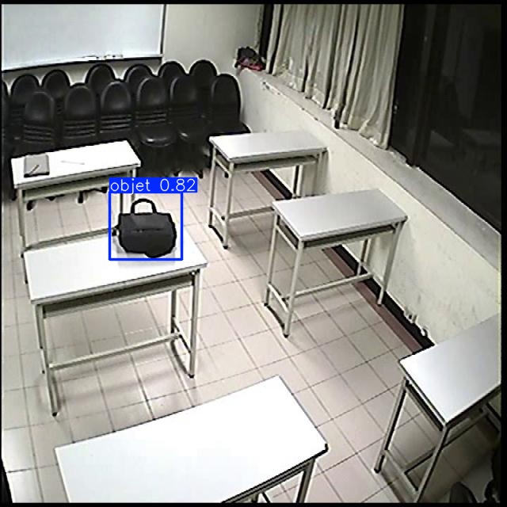

# Tomo — Abandoned Object Detection on FPGA (AOHW25_193)

**Competition:** AMD Open Hardware 2025 — Student / Adaptive Computing  
**Author:** Miguel Laleye  
**Supervisor:** Madani Mahdi, PhD

## 🎯 Objective
Tomo is an embedded system for **abandoned object (bag) detection** in public spaces (stations, halls, airports).  
It combines **FPGA pre-processing** (motion gating + resize/letterbox) on **Zybo Z7-10 + Pcam 5C** with **INT8–quantized YOLOv8n inference** on the ARM Cortex-A9.

## 🧱 Global Architecture
```
[Pcam 5C Camera]
	-> [PL/FPGA: MIPI capture -> MotionGate (WIP) -> Resize+Letterbox]
	-> [PS/ARM A9: YOLOv8n INT8 inference + NMS + "abandon" logic]
	-> [Outputs: alert, GUI overlay, metric logs]
```

<p align="center">
	<!-- Prefer PNG (generated via scripts/gen_arch_png.py) for GitHub readability -->
	
  <br/>
  <sub><em>Source SVG: docs/system_architecture.png </em></sub>
</p>

## 🖼 Example Detection

<p align="center">
	
	<br/>
	<em>Sample frame: INT8 YOLOv8n detection (bounding box + class) on a bag candidate.</em>
</p>

### FPGA (PL) Role
| Function | Detail | Rationale |
|----------|--------|-----------|
| MIPI Capture | Pcam to AXI Stream interface | Mandatory in programmable logic |
| Resize + Letterbox (HLS) | Format to 320×320 | Constant pipeline, frees CPU |
| MotionGate (WIP) | Trigger inference only on motion | Cuts CPU/energy usage |

### ARM (PS) Role
| Component | Role |
|-----------|------|
| TFLite / ONNX Runtime (INT8) | YOLOv8n inference |
| NMS + abandon logic | Stationary time + absence of nearby person |
| GUI / Logs | PC demo, alerts, metrics |

## ✅ Current Status
- [x] Merged dataset (Roboflow Abandoned Objects + COCO subset)  
- [x] YOLOv8n training + ONNX / TFLite INT8 export  
- [x] PC GUI (Tkinter/OpenCV) with abandoned-object logic  
- [x] HLS IP **ResizeLetterbox320** generated  
- [ ] HLS IP **MotionGate** (in development)  
- [ ] Zybo Z7-10 + Pcam integration (Vivado/Vitis)  
- [ ] Field tests & FP/FN tuning  

---

## 📂 Repository Structure
```
.
├─ dataset/            # scripts, notes dataset (Roboflow + COCO)
├─ training/           # config YOLOv8, notebooks entraînement/export
├─ gui/                # test_gui.py + requirements.txt (démo PC)
├─ fpga/
│  ├─ vivado/          # .xdc, .tcl, captures block design
│  ├─ vitis/           # app PS (C/C++), Makefile, notes
│  └─ hls/             # ResizeLetterbox320, MotionGate (WIP)
├─ docs/               # schémas, diagrammes
└─ report/             # Tomo_Report_OpenHW2025.pdf
```

---

## 🚀 Quick Start (PC Demo)
```bash
cd gui
pip install -r requirements.txt
python test_gui.py --video path/to/sample.mp4
```

*The GUI displays detections and triggers an alert if a bag remains stationary beyond a time threshold with no nearby person.*

---

## 🔧 Build (FPGA — Work In Progress)

* **Vivado 2025.1**: integrate HLS IP *ResizeLetterbox320* + *MotionGate* (WIP), connect Pcam (MIPI), generate bitstream.
* **Vitis Unified IDE 2025.1**: PS app (INT8 model load, NMS, business logic).

> Detailed notes: `fpga/vivado/project_notes.md`, `fpga/hls/*/ip_packaging_report.md`.

---

## 🧪 Training

* YOLOv8n (Ultralytics), INT8 post-training quantization, ONNX & TFLite exports.
* Training notebooks in `training/notebooks/`.
* Weights > 95 MB not tracked (recommend Git LFS or release assets).

---

## 🏗 Architecture & Roadmap

### Vision & Constraints

* **Use case**: abandoned bag detection with fixed camera.
* **Constraints**: ≥10–15 perceived FPS (motion gating), low power, low cost, open-source, reproducible.
* **Platform**: Zybo Z7-10 (Zynq-7010) + Pcam 5C.

### PL/PS Split

* Streamable, regular ops → **PL** (resize, gating).
* Complex control, business logic, ML inference → **PS**.

### Technical Choices

* **YOLOv8n + INT8**: compact model suited to ARM A9.
* **320×320 input**: balance small-object recall vs latency.
* **Motion gating**: skips redundant frames → power/perf gains.
* **Pre-processing in PL**: offloads CPU.
* **PC GUI**: rapid iteration on abandon logic.

### Data & Model

* Dataset: Roboflow Abandoned Objects + COCO subset (classes: *person, backpack, briefcase, handbag, suitcase*).
* Training: Ultralytics YOLOv8 on Colab → INT8 export.
* Next: add tracking (SORT/ByteTrack) + abandon-logic calibration.

### Timeline

1. Scope & PL/PS architecture definition.
2. Dataset merge.
3. YOLOv8n training + exports.
4. PC demo (GUI + abandon logic).
5. ResizeLetterbox320 IP (done).
6. MotionGate IP (in progress).
7. Vivado/Vitis integration.
8. Field tests, FP/FN tuning.

### Reproducibility

* Hardware: Zybo Z7-10, Pcam 5C, microSD.
* HLS: sources & TCL provided.
* Vivado: `.tcl` scripts + `.xdc` constraints.
* Vitis: C/C++ app + Makefile.
* Model: INT8 weights (≤95 MB) + notebooks.
* Docs: diagrams `docs/`, report `report/`.

### Expected Performance

| Scenario       | Target            |
| -------------- | ----------------- |
| No gating      | ~3–8 FPS raw      |
| With gating    | 10–15 perceived FPS |
| Alert latency  | < 1–2 s           |

---

## 🔗 Links 
* 📝 HotCRP: https://openhw2025.hotcrp.com
* 🆔 Team: **AOHW25_193**

---

## 📄 License

MIT © 2025 Miguel Laleye


